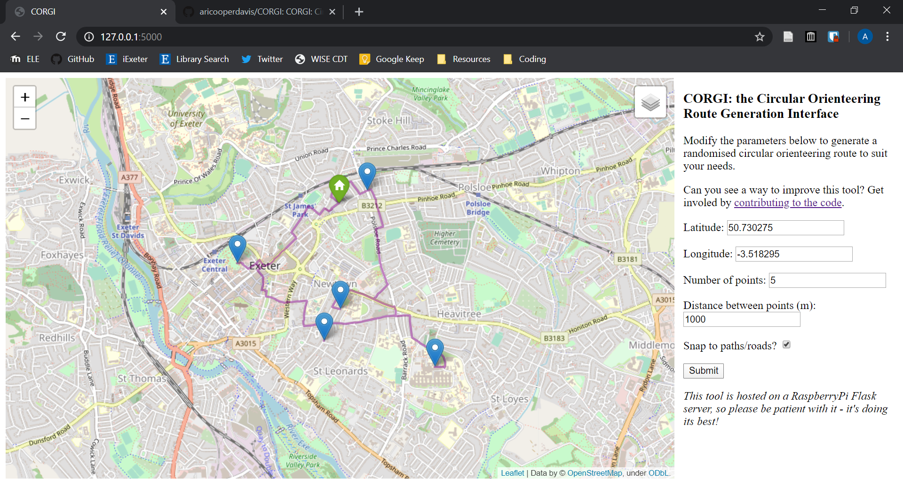

# CORGI
CORGI: Circular Orienteering Route Generation Interface

## What is CORGI?
CORGI is a python script that uses a flask server to generate interactive maps that you can view in your web browser. These maps are circular maps (as in, they lead back to where they started) with a set distance between the points.

You can choose to lock the points to OpenStreetMap Highway features if you want to be running on footpaths and roads, or you can let them go wherever they like if you're running in an open area. You can also change the distance between points, and the number of points to generate. You can even visualise the shortest route between the points.

## Requirements
This is a python script, tested on a Win64 machine running Python 3.7.5. If you do not have a similar setup then your mileage may vary.

This script uses a few external libraries that you'll need. At some point I will modify the code to only import those libraries when required, but for the moment you'll need all of them. They are:

* [Flask](https://pypi.org/project/Flask/)
* [Folium](https://pypi.org/project/folium/)
* [GeoPy](https://pypi.org/project/geopy/)
* [NetworkX](https://pypi.org/project/networkx/)
* [OSMnx](https://pypi.org/project/osmnx/)

## How do I use it?
1. Ensure that your computer meets the [Requirements](#Requirements).
2. Clone or download this repository
3. Navigate to it in your command prompt/terminal and run `python .\corgi.py`

This will start a flask server that hosts the project. You can then navigate to `http://127.0.0.1:5000/` in your web browser to see the map.

### Options
You can modify a number of options used to generate the map using the form on the right hand side of the map. The options available are:

| Option | Valid options (*default*) | Description |
| --- | --- | --- |
| `lat` | Float ±90 e.g. *`50.730275`* | Home (first/last point location) latitude in degrees |
| `lon` | Float ±180 e.g. *`-3.518295`* | Home longitude in degrees |
| `n` | Positive integer e.g. *`5`*| The number of points to run to (excluding home) marked on the map |
| `sep` | Positive integer e.g. *`1000`* | The max separation in meters between points generated. |
| `snap` | *`true`*/`false` | Whether or not the points generated should be snapped onto the nearest navigable way (e.g. path/road)|

**N.b.** when `snap` is True the points are generated and then snapped to the nearest way marked on OSM. As such the separation between points may then exceed the desired `sep` value.

## Can I contribute?
Yes please. Make a pull request if you make any improvements.

## Can I use this code?
Sure, but please ensure that you abide by the conditions of the copyleft license included with it.
